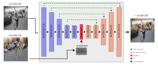

# Natural Video Colorization
<!--  -->


## Description
Complete pipeline to create and dataset to training from colored videos (than will be used as ground truth during the training), the evaluation the best losses for the training and an inference mode to create the colored version to originaly monocromatic videos.

## Requirement
- `torch` >= 1.13
- `torchvision` >= 0.4
- `cuda` >= 11.6
- `vit Pytorch` >= 0.40.2

## Network Topology



## Datasets

Two datasets are utilized in the training process, the [DAVIS 2017 (Densely Annotated VIdeo Segmentation)](https://davischallenge.org/) to training the weights and [Videvo](https://10.6084/m9.figshare.21766271) to validate the results of the model.

## Data Format

The input to colorize inference needs to be an monocromatic video and an example frame (preference of this video).
The code will resize and normalize the frames to predict the color. At the end, the video colorized will be saved at the `videos_output` folder.

<!-- ## Usage
```python
from lpips_pytorch import LPIPS, lpips


# define as a criterion module (recommended)
criterion = LPIPS(
    net_type='alex',  # choose a network type from ['alex', 'squeeze', 'vgg']
    version='0.1'  # Currently, v0.1 is supported
)
loss = criterion(x, y) -->